# Proyecto 2 — WordPress persistente con Docker Compose

Sitio WordPress con MySQL, orquestado con Docker Compose, con persistencia de datos mediante volúmenes nombrados, red personalizada y healthcheck.

## Descripción

El centro de formación requiere un sitio WordPress para publicar noticias del programa. Esta solución levanta WordPress y MySQL con un solo comando (`docker compose up -d`), conecta ambos servicios por nombre a través de una red personalizada, y persiste tanto la base de datos como los archivos subidos en volúmenes nombrados, de modo que la información sobrevive a `docker compose down`.

## Requisitos

- Docker
- Docker Compose (v2)

## Instrucciones de ejecución

1. Clonar el repositorio.
2. Crear el archivo `.env` a partir de la plantilla:
   ```
   copy .env.example .env
   ```
3. Levantar los servicios:
   ```
   docker compose up -d
   ```
4. Verificar que los servicios estén corriendo:
   ```
   docker compose ps
   ```
5. Acceder a `http://localhost:8000` (o el puerto definido en `.env`) y completar el asistente de instalación de WordPress.
6. Para detener los servicios sin perder datos:
   ```
   docker compose down
   ```
7. Para eliminar también los datos (volúmenes incluidos):
   ```
   docker compose down -v
   ```

## Preguntas

**¿Qué comando eliminaría también los datos y por qué debe usarse con cuidado?**
`docker compose down -v` elimina además los volúmenes nombrados, borrando permanentemente la base de datos y los archivos subidos. Debe usarse con cuidado porque es una acción irreversible.

**¿Por qué WordPress se conecta al host `db` y no a una dirección IP?**
Porque Docker Compose crea una red personalizada con DNS interno: cada servicio es accesible por su nombre dentro de esa red, sin importar la IP que le asigne Docker en cada arranque (las IPs de contenedores pueden cambiar; el nombre del servicio no).

**¿Qué aporta el healthcheck frente a un depends_on simple?**
Un `depends_on` simple solo espera a que el contenedor de la base de datos *inicie*, no a que esté *lista* para aceptar conexiones. El `healthcheck` verifica activamente (con `mysqladmin ping`) que MySQL ya acepta conexiones, y `depends_on: condition: service_healthy` hace que WordPress espere ese estado antes de arrancar, evitando errores de conexión al inicio.

## Evidencias

### Creación del repositorio
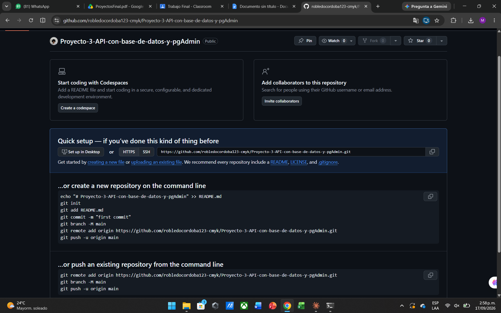

### docker-compose con WordPress, MySQL y volúmenes
Se agrega el `docker-compose.yml` con los servicios `db` y `wordpress`, volúmenes nombrados, red personalizada y healthcheck, y se sube al repositorio.

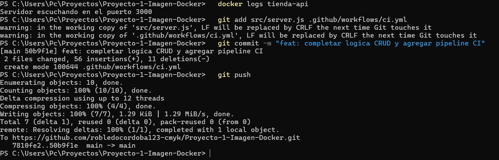

### Servicios levantados y sitio WordPress
Se crea el archivo `.env`, se levantan los servicios con `docker compose up -d` (MySQL queda `healthy` antes de que arranque WordPress) y se completa la instalación desde el navegador.

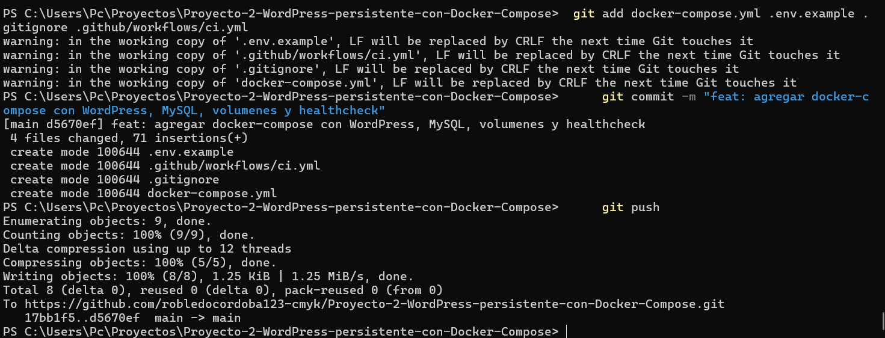
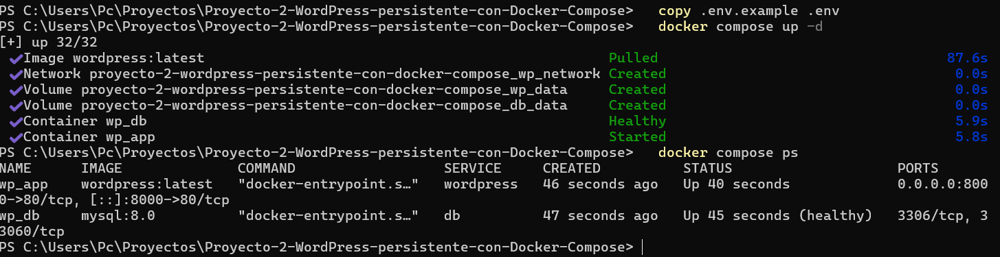
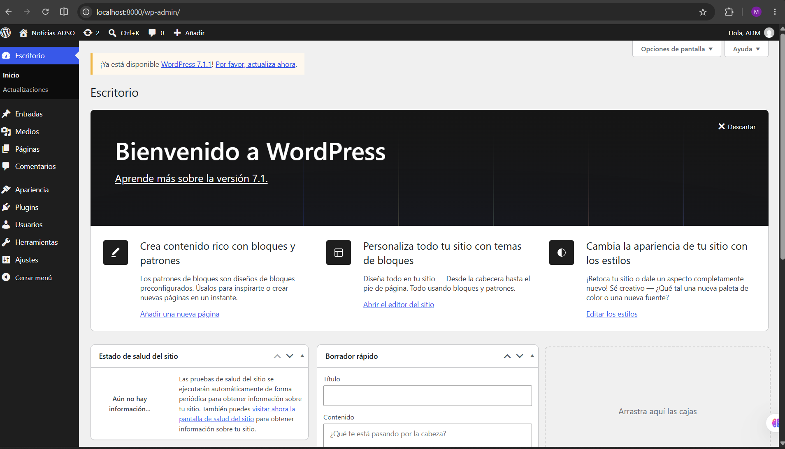
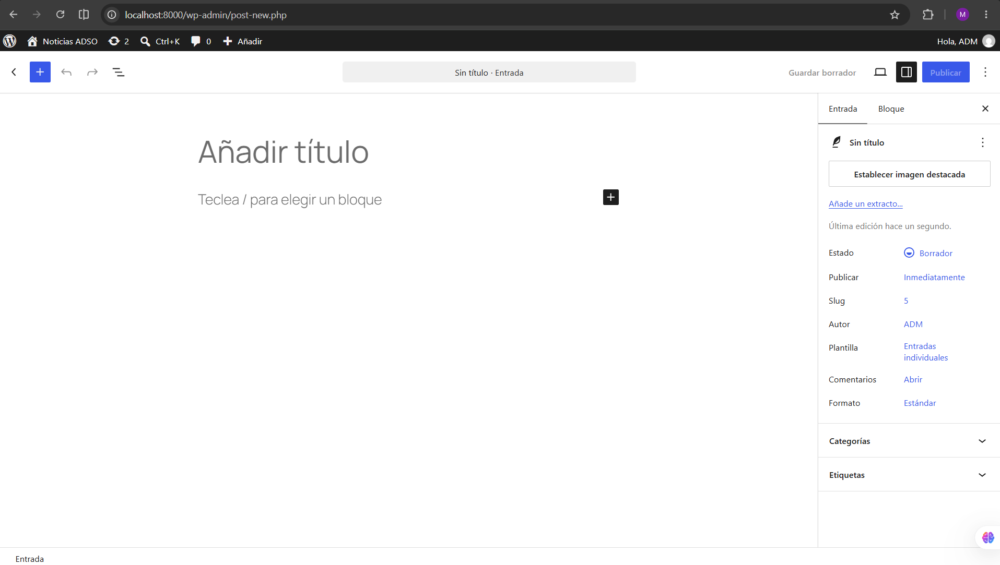

### Publicación de la entrada de prueba
Se crea y publica una entrada llamada "Prueba de persistencia" para verificar más adelante que los datos sobreviven a un reinicio de los contenedores.

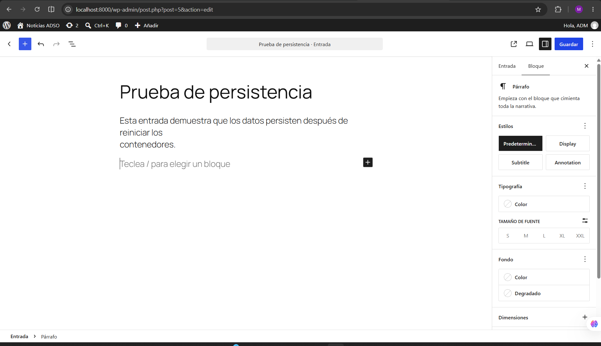
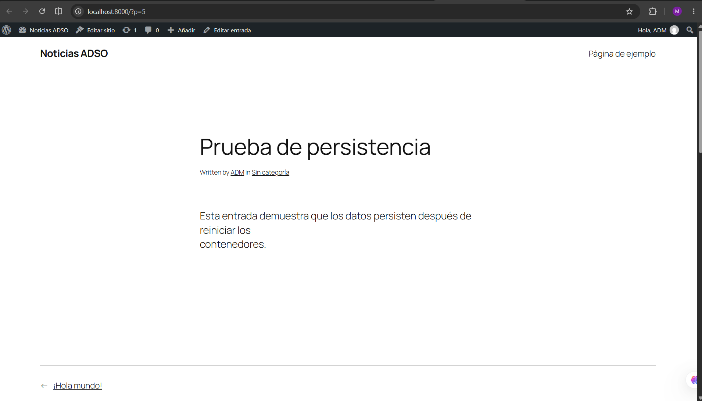
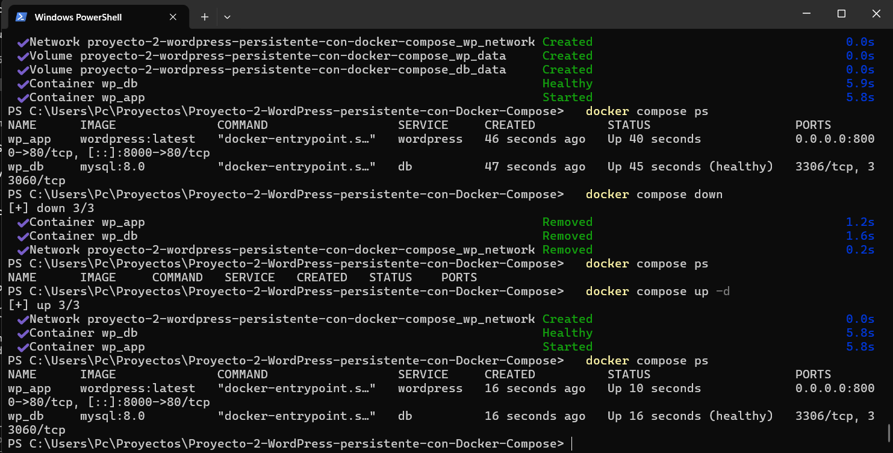
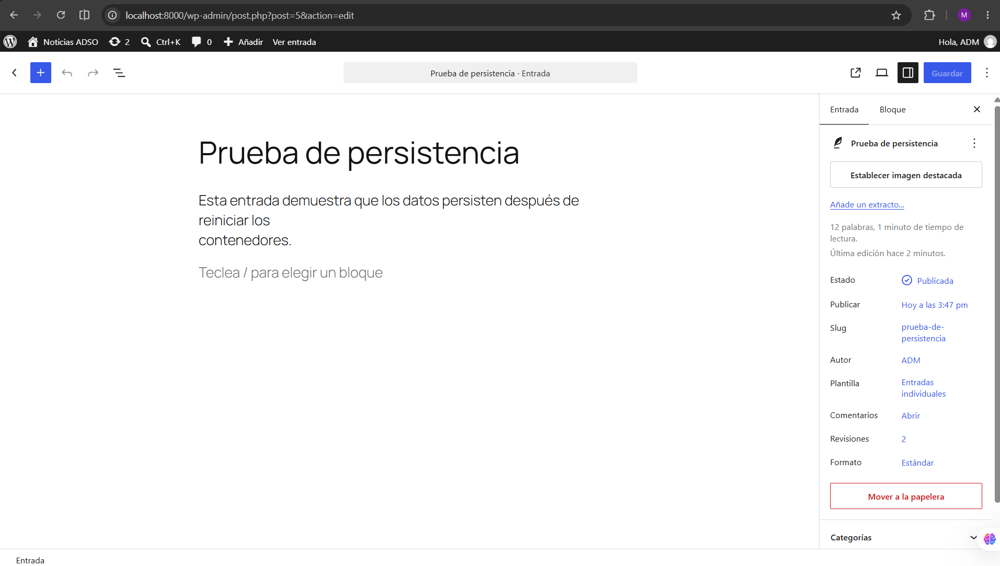

### Prueba de persistencia y volúmenes
Se detienen los contenedores con `docker compose down` (sin `-v`) y se vuelven a levantar con `docker compose up -d`: la entrada de prueba sigue publicada, y `docker volume ls` confirma que los volúmenes `db_data` y `wp_data` nunca se eliminaron.

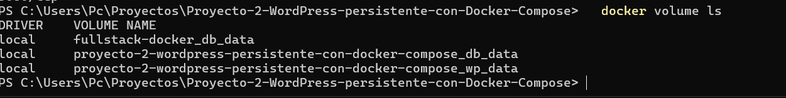
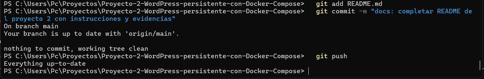

### Flujo de Pull Request
Se crea una rama corta, se abre un Pull Request hacia `main` y se fusiona, dejando el repositorio con una sola rama (`main`) pero con el historial del PR.

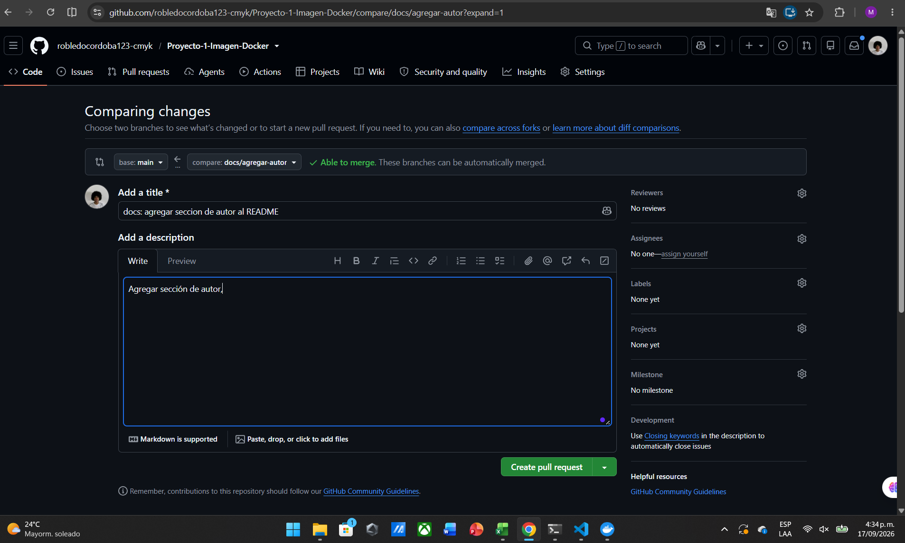
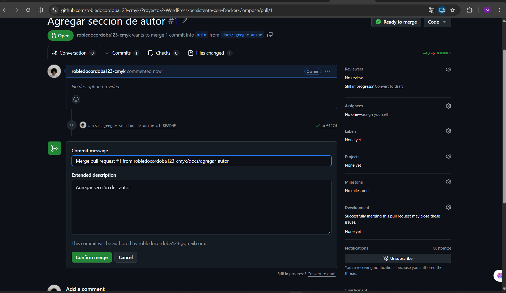
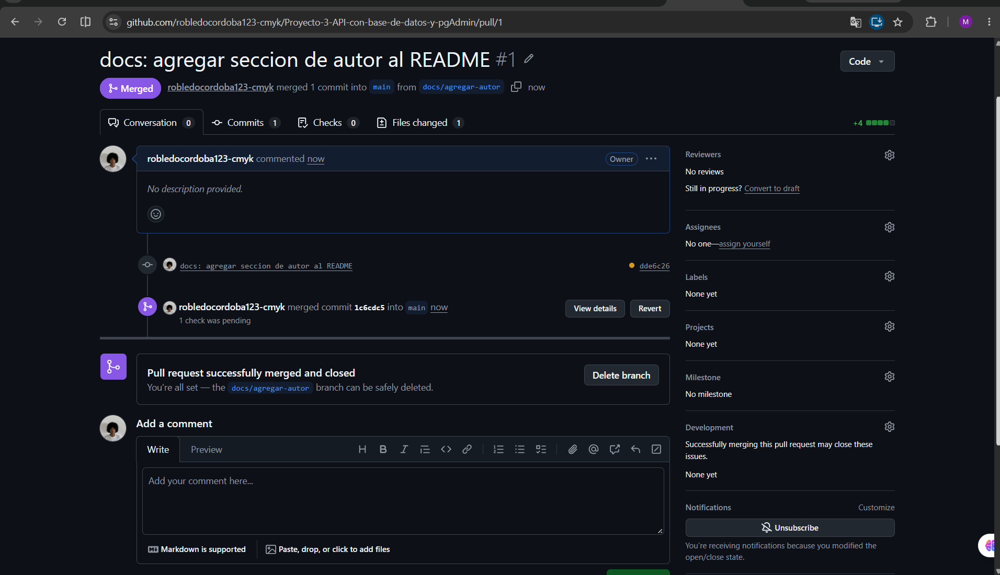

## Autor

Manuela Cordoba
